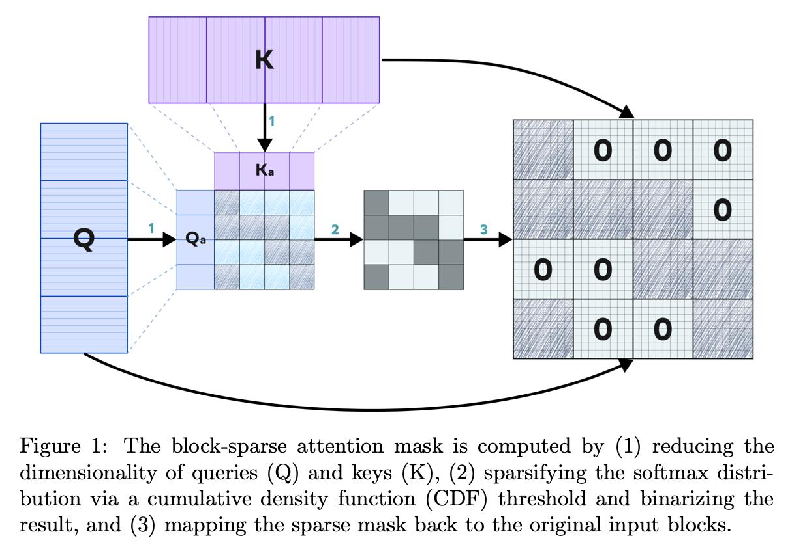

# ∇NABLA: Neighborhood Adaptive Block-Level Attention


> Efficient, adaptive, and hardware-friendly sparse attention for video generation with Diffusion Transformers (DiTs).

## 🔬 Overview

**NABLA** (Neighborhood Adaptive Block-Level Attention) is a dynamic sparse attention mechanism designed to optimize both training and inference in high-resolution video diffusion transformers. The algorithm is demonstrated using [Wan 2.1](https://github.com/gen-ai-team/Wan2.1) project — an advanced open-source text-to-video diffusion model — and significantly enhances its efficiency via sparse attention.

<p align="center">
    
<p>

📄 Paper: [arXiv:2507.13546](https://arxiv.org/abs/2507.13546)  
📁 Code & Models: [github.com/gen-ai-team/Wan2.1-NABLA](https://github.com/gen-ai-team/Wan2.1-NABLA)  
🔗 Upstream Model: [Wan 2.1 GitHub](https://github.com/Wan-Video/Wan2.1)  
🤗 Finetuned weights: [Wan-NABLA](https://huggingface.co/collections/ai-forever/wan-nabla-6882459cc8b826be2c0ef30e)

---

## 🚀 Features

- ⚡ **2.7× Faster** training & inference via adaptive attention sparsity (depends on video size and configuration)
- 🧠 **Maintains Quality** (CLIP/VBench/Human eval scores)
- 🔧 **Zero-Custom CUDA**: Implemented using PyTorch's Flex Attention
- 🎥 **Video generation ready**: Supports 720p+, high-dynamic, long-duration content
- 🤝 Compatible with [Sliding Tile Attention (STA)](https://arxiv.org/abs/2502.04507v3) and CrossAttention DiT models

---

## 📐 How It Works

NABLA works by:
1. **Downsampling** Q/K using average pooling.
2. **Computing attention** on the compressed space.
3. **Applying CDF-based binarization** to generate a sparse attention mask.
4. Directly using this mask in FlexAttention.
5. Optionally **combining** with STA masks for additional precision.

> See [Algorithm 1 in the paper](https://arxiv.org/abs/2507.13546) for detailed pseudocode.

Make sure you are using **PyTorch ≥ 2.7** for Flex Attention support.

---

### Usage examples:
We finetuned Wan2.1 with three perdefined configurations. You can download them from HuggingFace ([Wan-NABLA](https://huggingface.co/collections/ai-forever/wan-nabla-6882459cc8b826be2c0ef30e)), then use:
* NABLA with threshold 0.7
  ```bash
  python generate.py --task t2v-14B --size 1280*720 --ckpt_dir ./Wan2.1-T2V-14B-NABLA-0.7 --prompt {prompt} --frame_num {frame_num}
  ```
* NABLA with threshold 0.6 + STA with window sizes wT=11, wH=3, wW=3
  ```bash
  python generate.py --task t2v-14B --size 1280*720 --ckpt_dir ./Wan2.1-T2V-14B-NABLA-0.6-STA-11-3-3 --prompt {prompt} --frame_num {frame_num}
  ```
* NABLA with threshold 0.5 + STA with window sizes wT=11, wH=5, wW=5
  ```bash
  python generate.py --task t2v-14B --size 1280*720 --ckpt_dir ./Wan2.1-T2V-14B-NABLA-0.6-STA-11-5-5 --prompt {prompt} --frame_num {frame_num}
  ```

You also can use NABLA in Zero-Shot mode:
* Only NABLA:
  ```bash
  python generate.py --task t2v-14B --size 1280*720 --ckpt_dir ./Wan2.1-T2V-14B --prompt {prompt} --frame_num {frame_num} --sparse_algo nabla-{thr}
  ```
* Only STA (without optimal configuration search):
  ```bash
  python generate.py --task t2v-14B --size 1280*720 --ckpt_dir ./Wan2.1-T2V-14B --prompt {prompt} --frame_num {frame_num} --sparse_algo sta-{wT}-{wH}-{wW}
  ```
* NABLA + STA (without optimal configuration search):
  ```bash
  python generate.py --task t2v-14B --size 1280*720 --ckpt_dir ./Wan2.1-T2V-14B --prompt {prompt} --frame_num {frame_num} --sparse_algo nabla-{thr}_sta-{wT}-{wH}-{wW}
  ```
> NABLA supports video resolutions that are divisible by 128, so 1280x720 will be converted to 1280x640
---

## 📊 Results

| Method                        | Inference Time ↓ | CLIP Score ↑ | VBench Total ↑ | Human Eval Parity |
|------------------------------|------------------|--------------|----------------|--------------------|
| Full Attention (Wan 2.1)     | 8.35 min         | 42.06        | 83.16          | ✅                 |
| NABLA (0.4)                  | 3.07 min         | 42.08        | 83.17          | ✅                 |
| NABLA (0.2) + STA(11,24,24) | 3.13 min         | 41.98        | **83.22**      | ✅                 |

---

## 🤝 Citation

If you use this work in your research, please cite:

```bibtex
@misc{mikhailov2025nablanablaneighborhoodadaptiveblocklevel,
      title={$\nabla$NABLA: Neighborhood Adaptive Block-Level Attention}, 
      author={Dmitrii Mikhailov and Aleksey Letunovskiy and Maria Kovaleva and Vladimir Arkhipkin and Vladimir Korviakov and Vladimir Polovnikov and Viacheslav Vasilev and Evelina Sidorova and Denis Dimitrov},
      year={2025},
      eprint={2507.13546},
      archivePrefix={arXiv},
      primaryClass={cs.CV},
      url={https://arxiv.org/abs/2507.13546}, 
}
```

You may also want to cite the original [Wan 2.1 paper](https://arxiv.org/abs/2503.20314):

```bibtex
@article{wan2025,
      title={Wan: Open and Advanced Large-Scale Video Generative Models}, 
      author={Team Wan and Ang Wang and Baole Ai and Bin Wen and Chaojie Mao and Chen-Wei Xie and Di Chen and Feiwu Yu and Haiming Zhao and Jianxiao Yang and Jianyuan Zeng and Jiayu Wang and Jingfeng Zhang and Jingren Zhou and Jinkai Wang and Jixuan Chen and Kai Zhu and Kang Zhao and Keyu Yan and Lianghua Huang and Mengyang Feng and Ningyi Zhang and Pandeng Li and Pingyu Wu and Ruihang Chu and Ruili Feng and Shiwei Zhang and Siyang Sun and Tao Fang and Tianxing Wang and Tianyi Gui and Tingyu Weng and Tong Shen and Wei Lin and Wei Wang and Wei Wang and Wenmeng Zhou and Wente Wang and Wenting Shen and Wenyuan Yu and Xianzhong Shi and Xiaoming Huang and Xin Xu and Yan Kou and Yangyu Lv and Yifei Li and Yijing Liu and Yiming Wang and Yingya Zhang and Yitong Huang and Yong Li and You Wu and Yu Liu and Yulin Pan and Yun Zheng and Yuntao Hong and Yupeng Shi and Yutong Feng and Zeyinzi Jiang and Zhen Han and Zhi-Fan Wu and Ziyu Liu},
      journal = {arXiv preprint arXiv:2503.20314},
      year={2025}
}
```

---

## 📬 Contact

For questions or collaborations:  
📧 [vpkorvyakov@sberbank.ru](mailto:vpkorvyakov@sberbank.ru), [dimitrov.d.v@sberbank.ru](mailto:dimitrov.d.v@sberbank.ru)

---

## 📝 License

This project is licensed under the Apache 2.0 License. See the [LICENSE](LICENSE) file for details.